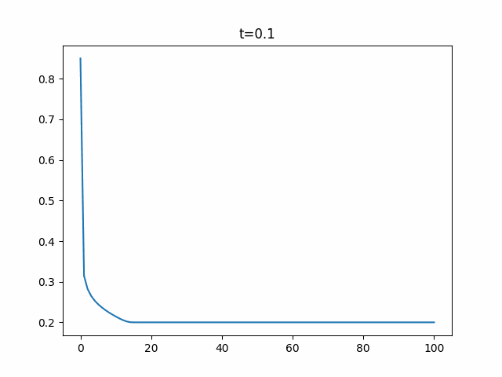

# Buckley-Lewerett solver

$$\frac{\partial S_w}{\partial t} = -\frac{q}{A} \frac{\partial f_w}{\partial x}$$

$L = 100 \ ft$

A = 1 $ft^2$

$\phi=0.2$

$P_c=0$

$g=0$

$\pho,\  \mu = const$

$\mu_o=50\ cP$

$t_{formation} = 70\ C$

$P_{formation} = 187\ atm$

$S_{ALI} = 10\ g/l$

$k_{ro}^*=1$

$k_{rw}^*=0.6$

$N_o=N_w=2$

## Corey model:

$S_{wn} = \frac{S_w - S_{wr}}{1 - S_{or} - S_{wc}}$

$$k_{ro} = k_{ro}^*(1-S_{wn})^{N_o}$$

$$k_{rw} = k_{rw}^*(S_{wn})^{N_w}$$

$$f_w = \frac{\lambda_w}{\lambda_w + \lambda_o}$$

$\lambda_w = \frac{k_{rw}}{\mu_w}$

## Solution

$\Delta t = 0.1 days$

$\Delta x = 1 ft$

