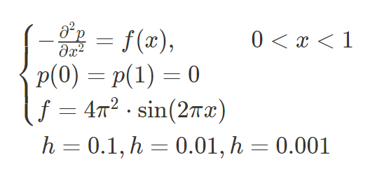
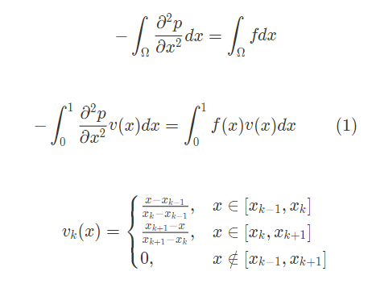
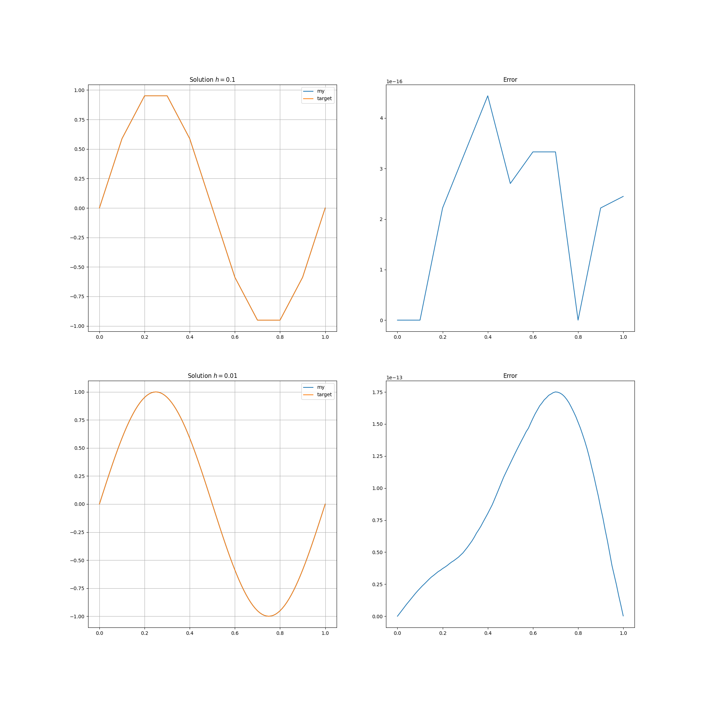

# Finite Element Method
_________
## Task:
Solve using Finite Element Method

Solution:

We are looking for a solution in the form:

$\sum_{k=1}^{n-1} p_k\phi(v_k, v_j) = \int_0^1 f(x) v_j(x) dx$

where

$\phi(v_k, v_j) = \int_0^1 v_k'v_j' dx$

$j = 1, \dots , n-1$

## Result:

