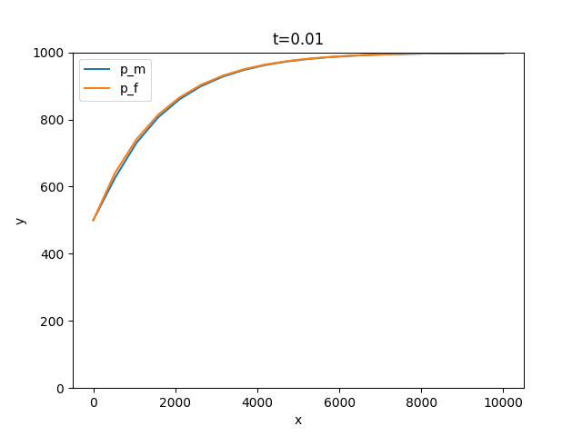

# Fracture
____

$$ \phi_m c_t \frac{\partial P_m}{\partial t} = \frac{\partial^2 P_m}{\partial x^2} \frac{K_m}{\mu} - \frac{\lambda}{A}(P_m - P_f)$$

$$ \phi_f c_t \frac{\partial P_f}{\partial t} = \frac{\partial^2 P_f}{\partial x^2} \frac{K_m}{\mu} - \frac{\lambda}{A}(P_m - P_f)$$

$\phi_m = 0.2,\ \phi_f = 0.01$

$k_m = 0.01,\ k_f = 50$

$\mu = 1$

$b_w = 1$

$c = 10^{-6}$

$L = 10^{4}$

$A = 200\ 000$

$\lambda = 100$

$p(t=0)=1000$

$x=L$ - leak-proof condition

$x=0$ - $p=500$

## Result
____

