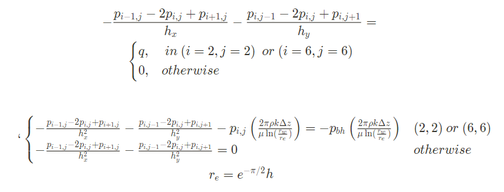
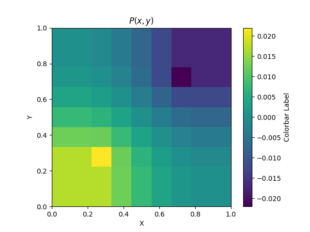

# Find pressure on grid with wells

$$-\frac{\partial^2p}{\partial x_1^2} -\frac{\partial^2 p}{\partial x_2^2} = q$$

$\Omega = (0,1) \times (0,1)$ 

$\Delta z = 1$

**Injection well:** (1/4, 1/4)

**Production well:** (3/4, 3/4)

$p_{bh}=1$ - Injection

$p_{bh}=-1$ - Production

$r_w = 0.001$ - Well radius

$\rho$=1

$\mu$=1

Boundary conditions:

$\nabla p \cdot \overrightarrow{n} = 0$

## Task

Solve on grid 9x9 using finite difference method

## Solution:

$q = (p - p_{bh})\frac{2\pi\rho k \Delta z}{\mu \ln(\frac{r_w}{r_e})}$ - Peaceman model

## Result:

